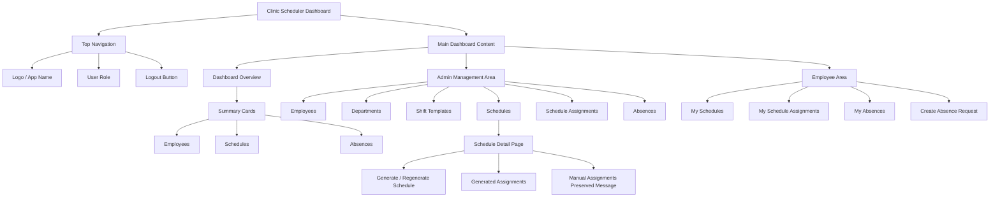

# Dashboard Wireframe

```mermaid
flowchart TD
  A["Clinic Scheduler Dashboard"] --> B["Top Navigation"]
  A --> C["Main Dashboard Content"]

  B --> B1["Logo / App Name"]
  B --> B2["User Role"]
  B --> B3["Logout Button"]

  C --> D["Dashboard Overview"]
  C --> E["Admin Management Area"]
  C --> F["Employee Area"]

  D --> D1["Summary Cards"]
  D1 --> D2["Employees"]
  D1 --> D3["Schedules"]
  D1 --> D4["Absences"]

  E --> E1["Employees"]
  E --> E2["Departments"]
  E --> E3["Shift Templates"]
  E --> E4["Schedules"]
  E --> E5["Schedule Assignments"]
  E --> E6["Absences"]

  F --> F1["My Schedules"]
  F --> F2["My Schedule Assignments"]
  F --> F3["My Absences"]
  F --> F4["Create Absence Request"]

  E4 --> G["Schedule Detail Page"]
  G --> G1["Generate / Regenerate Schedule"]
  G --> G2["Generated Assignments"]
  G --> G3["Manual Assignments Preserved Message"]
```
