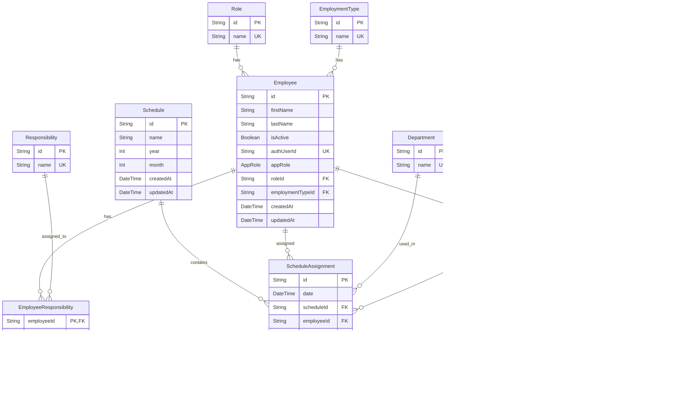

# Entity Relationship Diagram

```mermaid
erDiagram
  Employee {
    String id PK
    String firstName
    String lastName
    Boolean isActive
    String authUserId UK
    AppRole appRole
    String roleId FK
    String employmentTypeId FK
    DateTime createdAt
    DateTime updatedAt
  }

  Role {
    String id PK
    String name UK
  }

  EmploymentType {
    String id PK
    String name UK
  }

  Responsibility {
    String id PK
    String name UK
  }

  EmployeeResponsibility {
    String employeeId PK, FK
    String responsibilityId PK, FK
    Int proficiency
  }

  Department {
    String id PK
    String name UK
  }

  ShiftTemplate {
    String id PK
    String name UK
    String startTime
    String endTime
    Boolean isBreak
  }

  Schedule {
    String id PK
    String name
    Int year
    Int month
    DateTime createdAt
    DateTime updatedAt
  }

  ScheduleAssignment {
    String id PK
    DateTime date
    String scheduleId FK
    String employeeId FK
    String departmentId FK
    String shiftId FK
    String notes
    DateTime createdAt
    DateTime updatedAt
  }

  Absence {
    String id PK
    DateTime startDate
    DateTime endDate
    String notes
    AbsenceStatus status
    String employeeId FK
    String absenceTypeId FK
    DateTime createdAt
    DateTime updatedAt
  }

  AbsenceType {
    String id PK
    String name UK
  }

  Role ||--o{ Employee : has
  EmploymentType ||--o{ Employee : has

  Employee ||--o{ EmployeeResponsibility : has
  Responsibility ||--o{ EmployeeResponsibility : assigned_to

  Schedule ||--o{ ScheduleAssignment : contains
  Employee ||--o{ ScheduleAssignment : assigned
  Department ||--o{ ScheduleAssignment : used_in
  ShiftTemplate ||--o{ ScheduleAssignment : uses

  Employee ||--o{ Absence : has
  AbsenceType ||--o{ Absence : categorizes
```
