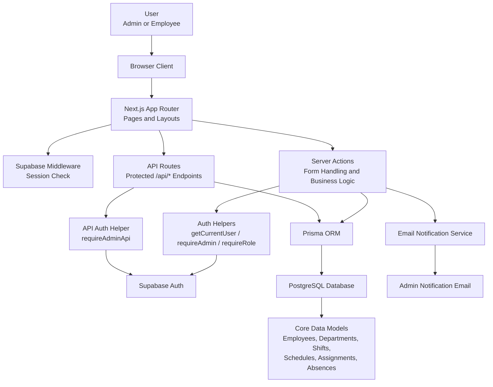

# System Architecture Diagram

```mermaid
flowchart TD
  User["User<br/>Admin or Employee"] --> Browser["Browser Client"]

  Browser --> NextApp["Next.js App Router<br/>Pages and Layouts"]

  NextApp --> Middleware["Supabase Middleware<br/>Session Check"]

  NextApp --> ServerActions["Server Actions<br/>Form Handling and Business Logic"]
  NextApp --> ApiRoutes["API Routes<br/>Protected /api/* Endpoints"]

  ServerActions --> AuthHelpers["Auth Helpers<br/>getCurrentUser / requireAdmin / requireRole"]
  ApiRoutes --> ApiAuth["API Auth Helper<br/>requireAdminApi"]

  AuthHelpers --> SupabaseAuth["Supabase Auth"]
  ApiAuth --> SupabaseAuth

  ServerActions --> Prisma["Prisma ORM"]
  ApiRoutes --> Prisma

  Prisma --> Postgres["PostgreSQL Database"]

  ServerActions --> Email["Email Notification Service"]
  Email --> AdminEmail["Admin Notification Email"]

  Postgres --> DataModels["Core Data Models<br/>Employees, Departments, Shifts,<br/>Schedules, Assignments, Absences"]
```
